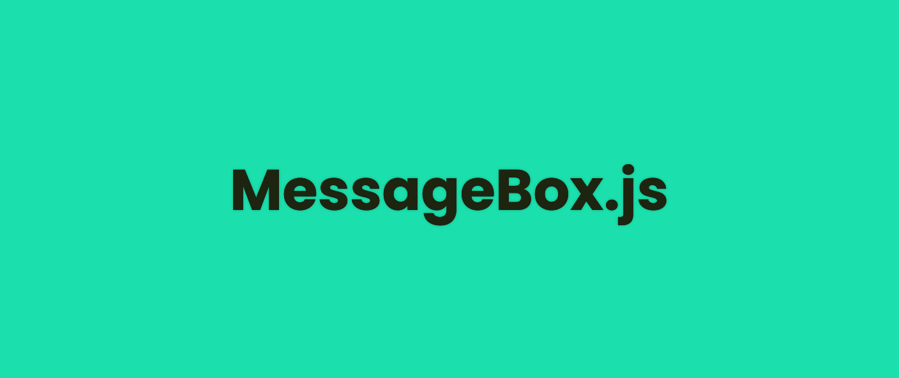
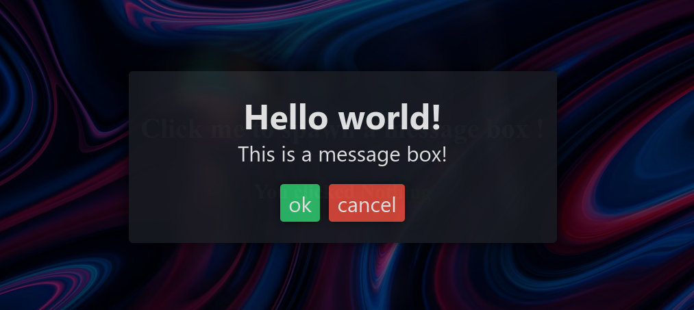
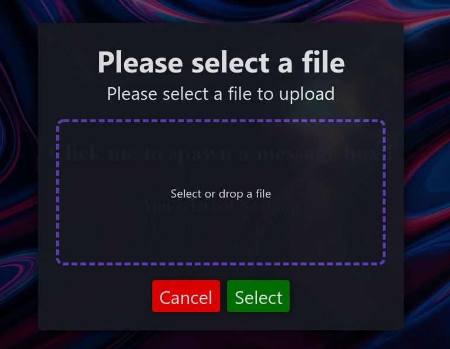

# MessageBox.js

Create beautiful and customizable message boxes 💬 for your website ✨



# Example

[A simple example of the usage of the library](https://skwalexe.github.io/MessageBox.js/example.html) is provided in this repository.

# JsDelivr 

```html
<script src="https://cdn.jsdelivr.net/gh/SkwalExe/MessageBox.js@v0.3.0/dist/messagebox.min.js"></script>
```

# NPM module 

Install the npm module 

```bash
npm install messagebox.js
```

And import it in your project 

```js
const MessageBox = require('messagebox.js');
```

**⚠️ You will need to bundle the package with your application (for example with browserify) because this library only works in the browser**

```bash
browserify index.js -o bundle.js
```

# Setting up 

You can import the library into you website with [JsDelivr](#JsDelivr) or, you can use the [npm module](#NPM-module) and import it in your project.

**You also need to import the css file to your website**

```html
<link rel="stylesheet" href="https://cdn.jsdelivr.net/npm/messagebox.js@0.3.0/dist/themes/messagebox-default.min.css">
```

# Your first message box ✨

```js
// --- node.js only ---
const MessageBox = require('messagebox.js');
// --------------------

let myMessageBox = new MessageBox()
  .setTitle('Hello world!')
  .setMessage('This is a message box!')
  .addButton("ok", "green")
  .addButton("cancel", "red");
```

We created our first message box. Now let's show it to the user and wait for his response.

```js
myMessageBox.show().then(response => { 
  console.log('The user clicked : ' + response)
})
```



*The user clicks on the "ok" button.*

```bash
# in the console 
> The use clicked : ok
```

## the `.setTitle()` method 📝

The `.setTitle(text)` method allows you to set the title of the message box.

## the `.setMessage()` method 📝

The `.setMessage(text)` method allows you to set the content of the message box.

## the `.addButton()` method 📝

The `.addButton(text, color)` method allows you to add a button to the message box.

When the user clicks on the button, the promise will be resolved with the text of the button.

The `color` parameter can be any html color.

Example:

- `#ff0000`
- `red`
- `rgb(255, 0, 0)`

## the `.askForFile()` method 📝

This method allows you to ask the user to select a file, see the section below.

# File selection 📂

You can make your message box ask the user to select a file.

```js
let myMessageBox = new MessageBox()
  .setTitle('Please select a file')
  .setMessage('Please select a file to upload')
  .askForFile() // <---

myMessageBox.show().then(file => ...)
```



This will return a `File` object.

**Note: custom buttons will be ignored**

# Custom styles 💅

You can customize the look of the message box by adding your own css styles to the `style.css` file.

# final

If you have any problem, don't hesitate to open an issue

# Contributing 💪

1. Start by [**forking** this repository](https://github.com/SkwalExe/MessageBox.js/fork)

2. Then clone your fork to your local machine.
  ```git
  git clone https://github.com/your-username/MessageBox.js.git
  ```

3. Install dev dependencies
```npm
npm install --save-dev
```

4. Create a new branch
  ```git
  git checkout -b super-cool-feature
  ```

5. Then make your changes

6. Update the changelog and version number if needed (using [Semantic Versioning](https://semver.org)) also, update the version number in the JsDelivr links (js and css)
  ```bash
  # bug fix
  npm version patch --no-git-tag-version

  # add a new feature 
  npm version minor --no-git-tag-version
  
  # changes that break backwards compatibility
  npm version major --no-git-tag-version
  ```

7. List and correct linting errors
  ```bash
  npm run lint
  ```

8. Update the minified/browser version of the library
  ```bash
  npm run build
  ```


9. Once you're done, commit your changes and push them to the remote repository.
  ```git
  git add --all
  git commit -m "Add super-cool-feature"
  git push origin super-cool-feature
  ```

10. Then, open a pull request on GitHub from your fork.
    1. Go to [this link](https://github.com/SkwalExe/MessageBox.js/compare/)
    2. Click compare across forks
    3. On the right, on `head repository` select your fork
    4. And on `compare` select the branch you just created
    5. Click on `Create Pull Request` and submit your pull request


<a href="https://github.com/SkwalExe#ukraine"></a>